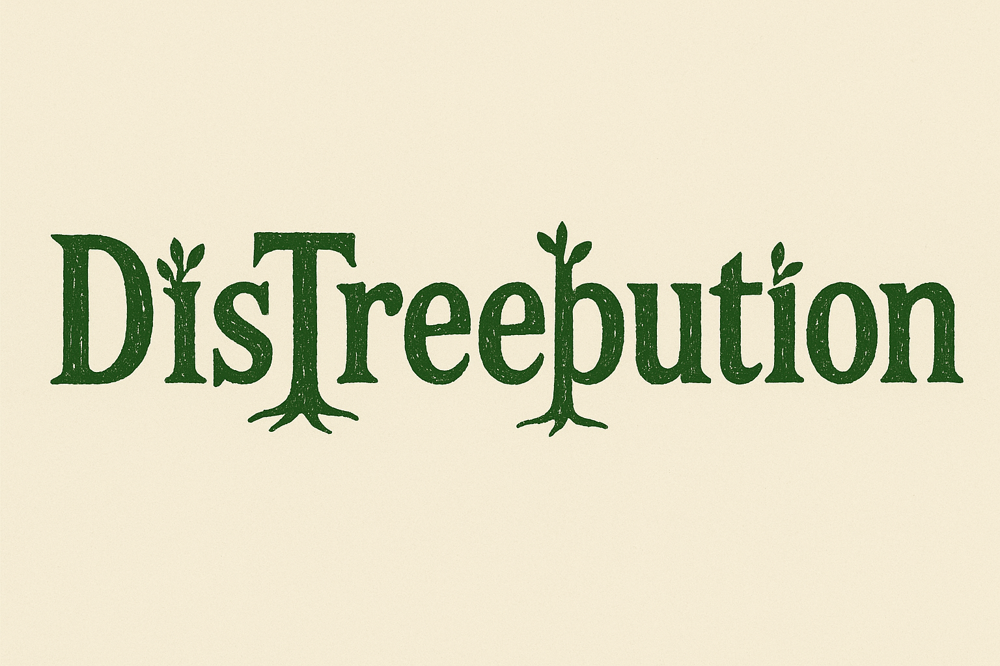

<p align="center">
  <a href="https://www.python.org/downloads/">
    
  </a>
  <a href="LICENSE">
    
  </a>
  <a href="https://hub.docker.com/r/quentinduchemin/distreebution">
    
  </a>
</p>


# DisTreebution

## Documentation

For detailed documentation and tutorials, visit: [Documentation](https://quentin-duchemin.github.io/DisTreebution/)


**DisTreebution** fits **distributional regression trees and forests** to generate **calibrated probabilistic forecasts**.

It optimizes trees using:  
- A sum of **Pinball losses** for multiple-quantile regression  
- **CRPS (Continuous Ranked Probability Score)** for full distributional regression  


The package also includes implementations of split conformal prediction methods built upon these forests of distributional trees. Two main conformal approaches are provided:
- [Conformalized Quantile Regression](https://arxiv.org/abs/1905.03222), where nested sets are of the form $$\left( [q_{\beta}-t , q_{1-\beta} +t] \right)_t$$ for some nominal level $\beta$.
  
- [Distributional Conformal Prediction](https://arxiv.org/abs/1909.07889), where nested sets are of the form $$\left( [q_{t} , q_{1-t}] \right)_t$$.

  
**Paper:** [https://arxiv.org/abs/2502.05157](https://arxiv.org/abs/2502.05157)


## Installation

You can install **DisTreebution** in three ways. We **recommend using the VS Code Dev Container** for the easiest and most reproducible workflow.

---

### Option 1 — Use VS Code Dev Container (recommended)

The easiest way to use **DisTreebution** is via a **VS Code Dev Container**:

1. Make sure you have:
   - [Visual Studio Code](https://code.visualstudio.com/)
   - [Docker](https://www.docker.com/) running
   - VS Code **Dev Containers** extension installed
   - Cloned this repository 

2. Open the project folder (the folder containing `.devcontainer/` and `notebooks/`) in VS Code.

3. Press **Ctrl+Shift+P** (or Cmd+Shift+P on macOS) → search **Dev Containers: Reopen in Container** → press Enter.

4. VS Code will:
   - Pull the `quentinduchemin/distreebution` Docker image if necessary  
   - Mount your project folder into the container at `/workspace`  
   - Open a fully configured environment with Python, Jupyter, and all dependencies ready  

5. You can now open notebooks in `notebooks/` directly inside VS Code and run DisTreebution without additional setup.


### Option 2 — Install from source

```bash
git clone https://github.com/quentin-duchemin/DisTreebution
cd DisTreebution
pip install -e .
```

### Option 3 — Use Docker without VSCode

A pre-built Docker image are available on Docker Hub:

- [`quentinduchemin/distreebution`](https://hub.docker.com/r/quentinduchemin/distreebution)  


Pull the images:

```bash
docker pull quentinduchemin/distreebution
```

Run the image:

```bash
docker run --rm -it \
  -v $(pwd):/workspace \
  -w /workspace \
  quentinduchemin/distreebution
```


---

## Tutorial

For tutorial and examples:  [Tutorial Notebook](notebooks/reproducing_results_paper.ipynb)


---

## Citation

If you use **DisTreebution** in your research, please cite:

```bibtex
@article{distreebution2026,
  title={Efficient distributional regression trees learning algorithms for calibrated non-parametric probabilistic forecasts},
  author={Quentin Duchemin and Guillaume Obozinski},
  year={2026}
}
```

---

## License

This project is licensed under the **BSD 3-Clause License**.  
See the [LICENSE](LICENSE) file for details.

